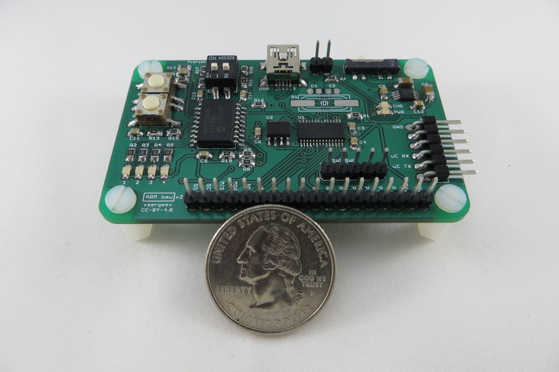
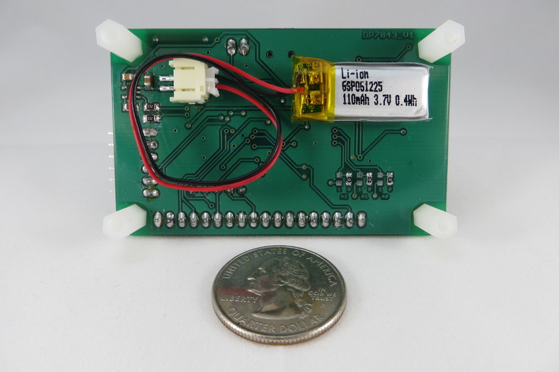
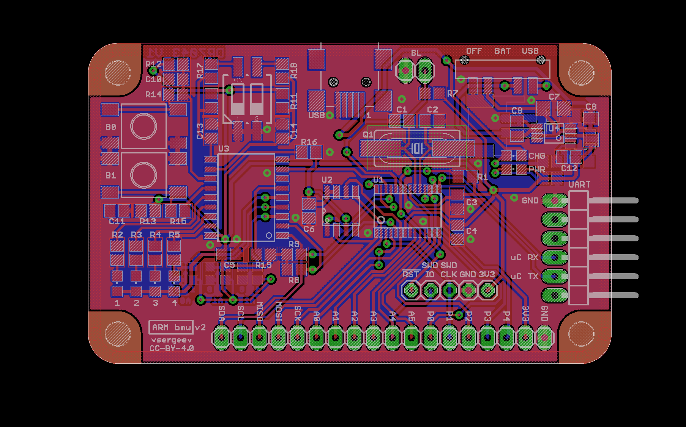

# arm-bmw-hw

The ARM Bare Metal Widget (arm-bmw) is an open hardware Cortex-M0 development board with a focus on battery power, non-volatile storage, and debuggability. It is suitable as a battery-powered data logger or a general purpose embedded controller.

The arm-bmw features a small 70 x 43mm footprint, lithium polymer battery and USB power selection, a lithium polymer battery charger, a 2-megabyte Flash memory for data storage, a basic user interface, an FTDI-cable compatible UART header, JTAG-SWD for flashing and debugging, and 16 assorted I/O for connectivity. Its [BOM](#bill-of-materials) totals to under $15 USD. The arm-bmw is open hardware (CC-BY-4.0 licensed) and open source (MIT licensed).

## Hardware Sources

Git: `git clone https://github.com/vsergeev/arm-bmw-hw.git`

Git: `git clone http://git.theanine.io/arm-bmw-hw.git`

GitHub: <https://github.com/vsergeev/arm-bmw-hw>

## Software Sources

Git: `git clone https://github.com/vsergeev/arm-bmw-sw.git`

Git: `git clone http://git.theanine.io/arm-bmw-sw.git`

GitHub: <https://github.com/vsergeev/arm-bmw-sw>

The arm-bmw-sw project includes a testing suite to verify the correct operation of the UART, SPI, I2C, SPI Flash, I/O Expander, LEDs, and Buttons.

## Photos

## Specifications

* [NXP LPC1114FDH28](http://www.nxp.com/products/microcontrollers/cortex_m0_m0/lpc1100/LPC1114FDH28.html) 32-bit Cortex-M0 microcontroller
    * Up to 50MHz CPU
    * 12MHz on-chip RC oscillator
    * 32kB Flash, 8kB SRAM
    * 6-ch ADC, I2C, SPI, UART, PWM, Capture
* On-board 16-MBit (2-Mbyte) SPI Flash Memory (S25FL216K)
* Power
    * USB (mini-B connector) or LiPo Battery powered
    * 3-position power switch to select power between OFF, BAT, USB
    * On-board LiPo Battery Charger ([MCP73831T](http://www.microchip.com/wwwproducts/Devices.aspx?dDocName=en024903))
    * Power LED, Charge LED
* User Interface
    * On-board I2C I/O expander to save microcontroller I/Os ([MCP23008](http://www.microchip.com/wwwproducts/Devices.aspx?product=MCP23008))
    * 4 LEDs
    * 2 push buttons
    * 2 DIP switches
* Input/Output
    * 16-pin 0.1" pitch I/O header with I2C, SPI, Analog, Digital and Power pins
    * JTAG [Serial Wire Debug](http://www.arm.com/products/system-ip/debug-trace/coresight-soc-components/serial-wire-debug.php) header for Flashing and Debug
    * UART header, 6-pin [TTL-232R-3V3](http://www.ftdichip.com/Products/Cables/USBTTLSerial.htm) compatible
* Board
    * [Dangerous Prototypes SoB DP7043](http://dangerousprototypes.com/docs/Sick_of_Beige_standard_PCB_sizes_v1.0) (70x43mm / 2.756x1.693in) footprint
    * 4 mounting holes
* Miscellaneous
    * Optional external crystal and load capacitor pads
    * Hand-solderable packages

See the [datasheets](#datasheets) section below for links to part datasheets.

## Details and Pinout

### Power and Charging

The arm-bmw provides a female JST-PH connector to accept a 3.7V lithium polymer battery, and a USB mini-B connector to accept 5V power from USB. The USB mini-B connector is only used for power, not data. A 3-position slide switch on the front selects between off, battery power, and USB power. The red Power LED indicates that 3.3V is present and that the arm-bmw is on. The orange Charge LED indicates that the lithium polymer battery is being charged from 5V USB power.

The onboard [MCP1252](http://www.microchip.com/wwwproducts/Devices.aspx?product=MCP1252) switched capacitor DC/DC converter regulates a 2V to 5.5V input to 3.3V, automatically switching between step down and step up operation as needed to provide 3.3V. This provides continuous power from a 3.7V lithium polymer battery as it drains to below 3.3V volts. The voltage regulator has a maximum output current of 120mA, so the arm-bmw should not be used to drive heavy loads alone.

The [MCP73831T](http://www.microchip.com/wwwproducts/Devices.aspx?dDocName=en024903) charge controller facilitates charging the connected lithium polymer battery. It operates whenever 5V power is present via the USB mini-B connector, regardless of the power slide switch state.

### Programming

The arm-bmw can be programmed and interactively debugged through its 5-pin JTAG-SWD header, with a SWD dongle like the [ST-LINK/V2](http://www.st.com/web/catalog/tools/FM146/CL1984/SC724/SS1677/PF251168?sc=internet/evalboard/product/251168.jsp). This dongle and the LPC1114 target are supported by [OpenOCD](http://openocd.sourceforge.net/). See [arm-bmw-sw](#software-sources) for configuration scripts for flashing and debugging over JTAG-SWD with openocd. See the JTAG-SWD header pinout [below](#jtag-swd-header-pinout).

The arm-bmw also supports programming over UART with its on-chip ROM bootloader. The 2-pin bootloader header on the front can be jumpered to start the on-chip ROM bootloader on reset. Software like [lpc21isp](http://sourceforge.net/projects/lpc21isp/) or [Flash Magic](http://www.flashmagictool.com/) can be used to program the LPC1114, over a UART-to-USB or UART-to-RS232 cable connected to the UART header. See the UART header pinout [below](#uart-header-pinout).

### SPI Flash Memory

The arm-bmw features a S25FL216K 16-MBit (2-MByte) SPI Flash for non-volatile storage in data logging applications. This SPI device is connected to the SPI0 controller of the microcontroller, sharing the MOSI, MISO, and SCK pins that are available on the main [I/O header](#io-header-pinout). One microcontroller pin (`PIO0_2/SSEL0`) is dedicated to controlling its chip select.

### User Interface

The arm-bmw features a basic user interface, consisting of 4 LEDs, 2 push buttons, and 2 DIP switches. These 4 outputs and 4 inputs (8 I/Os total) are managed by an [MCP23008](http://www.microchip.com/wwwproducts/Devices.aspx?product=MCP23008) I2C I/O expander to conserve I/O pins on the microcontroller. The MCP23008 is connected to the I2C bus of the microcontroller, sharing the SDA and SCL pins that are available on the main [I/O header](#io-header-pinout). In addition, one microcontroller pin (`PIO0_3`) is dedicated to the MCP23008 interrupt. The push buttons and DIP switches are debounced in hardware with an RC filter, to ensure that the MCP23008 interrupt is not spurious and to minimize the need for software debouncing.

The I2C address of the MCP23008 is configured by populating three 0-ohm jumpers on the back of the board, in either a 0 or 1 position, which pull down or up the MCP23008's A0, A1, A2 pins. By default, these three jumpers are in the 0 position, and the MCP23008 has an address of `0x20` on the I2C bus.

Free software to drive the I2C bus, MCP23008 chip, and manage the UI is avaiable in the [arm-bmw-sw library](#software-sources).

### Optional Settings

The LPC1114 microcontroller has an on-chip 12MHz RC oscillator, which can be configured with the internal PLL to provide a 48MHz system clock using no external parts. The arm-bmw also provides pads for an external HC49UP crystal and load 0805 capacitors in cases where a more accurate oscillator or a different multiple is required.

### I/O Header Pinout

The I/O header exposes one I2C bus (SDA, SCL), one SPI bus (MISO, MOSI, SCK), and 11 additional pins that may be used as digital I/O, ADC inputs, timer capture inputs, or PWM outputs, depending on the pin's supported functions.

| BMW Pin | uC Pin    | uC Pin Functions                  | Notes                             |
|:--------|:----------|:----------------------------------|:----------------------------------|
| `SDA`   | `PIO0_5`  | `PIO0_5/SDA`                      | I/O Expander shares this I2C bus. Pulled up with 10K. |
| `SCL`   | `PIO0_4`  | `PIO0_4/SCL`                      | I/O Expander shares this I2C bus. Pulled up with 10K. |
| `MISO`  | `PIO0_8`  | `PIO0_8/MISO0/CT16B0_MAT0`        | SPI Flash shares this SPI bus.    |
| `MOSI`  | `PIO0_9`  | `PIO0_9/MOSI0/CT16B0_MAT1`        | SPI Flash shares this SPI bus.    |
| `SCK`   | `PIO0_6`  | `PIO0_6/SCK0`                     | SPI Flash shares this SPI bus.    |
| `A0`    | `PIO0_11` | `PIO0_11/AD0/CT32B0_MAT3`         |                                   |
| `A1`    | `PIO1_0`  | `PIO1_0/AD1/CT32B1_CAP0`          |                                   |
| `A2`    | `PIO1_1`  | `PIO1_1/AD2/CT32B1_MAT0`          |                                   |
| `A3`    | `PIO1_2`  | `PIO1_2/AD3/CT32B1_MAT1`          |                                   |
| `A4`    | `PIO1_3`  | `SWDIO/PIO1_3/AD4/CT32B1_MAT2`    | JTAG-SWD header shares this pin.  |
| `A5`    | `PIO1_4`  | `PIO1_4/AD5/CT32B1_MAT3/WAKEUP`   |                                   |
| `P0`    | `PIO0_7`  | `PIO0_7/CTS`                      |                                   |
| `P1`    | `PIO0_10` | `SWCLK/PIO0_10/SCK0/CT16B0_MAT2`  | JTAG-SWD header shares this pin.  |
| `P2`    | `PIO1_5`  | `PIO1_5/RTS/CT32B0_CAP0`          |                                   |
| `P3`    | `PIO1_8`  | `PIO1_8/CT16B1_CAP0`              |                                   |
| `P4`    | `PIO1_9`  | `PIO1_9/CT16B1_MAT0`              |                                   |
| `3V3`   | -         | -                                 |                                   |
| `GND`   | -         | -                                 |                                   |

### JTAG-SWD Header Pinout

Compatible with [ST-LINK/V2](http://www.st.com/web/catalog/tools/FM146/CL1984/SC724/SS1677/PF251168?sc=internet/evalboard/product/251168.jsp) and other JTAG-SWD dongles.

| BMW Pin  | uC Pin    | uC Pin Functions                  | Notes                             |
|:---------|:----------|:----------------------------------|:----------------------------------|
| `!RST`   | `PIO0_0`  | `!RESET/PIO0_0`                   | Pulled up with 10K.               |
| `SWDIO`  | `PIO1_3`  | `SWDIO/PIO1_3/AD4/CT32B1_MAT2`    |                                   |
| `SWDCLK` | `PIO0_10` | `SWCLK/PIO0_10/SCK0/CT16B0_MAT2`  |                                   |
| `GND`    | -         | -                                 |                                   |
| `3V3`    | -         | -                                 |                                   |

### UART Header Pinout

Compatible with the [FTDI TTL-232R-3V3 cable](http://www.ftdichip.com/Products/Cables/USBTTLSerial.htm).

| BMW Pin | uC Pin   | uC Pin Functions                  | Notes                             |
|:--------|:---------|:----------------------------------|:----------------------------------|
| `GND`   | -        | -                                 |                                   |
| `NC`    | -        | -                                 |                                   |
| `NC`    | -        | -                                 |                                   |
| `uC RX` | `PIO1_6` | `PIO1_6/RXD/CT32B0_MAT0`          |                                   |
| `uC TX` | `PIO1_7` | `PIO1_7/TXD/CT32B0_MAT1`          |                                   |
| `NC`    | -        | -                                 |                                   |

## Schematic, Board, BOM

### Schematic

### Board Layout

### Bill of Materials

| Qty   | Part                                      | Description           | Digi-key PN               | Order Qty     | Total Price |
|:------|:------------------------------------------|:----------------------|:--------------------------|:--------------|:------------|
| 1     | U1                                      | ARM Cortex-M0 MCU     | Arrow LPC1114FDH28/102:5  | 1             | ~2.50       |
| 1     | U2                                      | SPI Flash Memory      | 1274-1052-ND              | 1             | 0.32        |
| 1     | U3                                      | I2C I/O Expander      | MCP23008-E/SO-ND          | 1             | 1.22        |
| 1     | U4                                      | 3.3V Regulator        | MCP1252-33X50I/MS-ND      | 1             | 1.64        |
| 1     | U5                                      | LiPo Charger          | MCP73831T-2ACI/OTCT-ND    | 1             | 0.67        |
| 8     | C3, C4, C5, C6, C10, C11, C13, C14             | C 0805 0.1uF          | 1276-1099-1-ND            | 10            | 0.44        |
| 2     | C9, C12                                  | C 0805 1uF            | 1276-1066-1-ND            | 5             | 0.50        |
| 2     | C15, C16                                 | C 0805 4.7uF          | 1276-1244-1-ND            | 5             | 0.75        |
| 2     | C7, C8                                   | C 1206 10uF           | 1276-1075-1-ND            | 5             | 1.15        |
| 8     | R1, R7, R8, R9, R14, R15, R16, R17, R18, R19, R27 | R 0805 10k            | 1276-5332-1-ND            | 15            | 0.30        |
| 4     | R10, R11, R12, R13                         | R 0805 100k           | 1276-3512-1-ND            | 10            | 0.20        |
| 6     | R20, R21, R22, R23, R24, R25                 | R 0603 0 jumper       | RHM0.0CGCT-ND             | 10            | 0.10        |
| 4     | LED1, LED2, LED3, LED4                     | Green LED             | 475-1410-1-ND             | 5             | 0.40        |
| 1     | LED_PWR                                 | Red LED               | 475-1415-1-ND             | 2             | 0.16        |
| 1     | LED_CHG                                 | Orange LED            | 754-1130-1-ND             | 2             | 0.40        |
| 5     | R2, R3, R4, R5, R6, R26                      | R 0805 for LED 1.5k   | 1276-5533-1-ND            | 10            | 0.18        |
| 1     | CON_BAT                                 | JST-PH Connector      | 455-1749-1-ND             | 1             | 0.56        |
| 1     | CON_USB                                 | USB Mini-B Connector  | 151-1206-1-ND             | 1             | 0.41        |
| 1     | JP_*,TP_*                               | 40p header break-away | S1012EC-30-ND             | 1             | 0.48        |
| 1     | JP_UART                                 | 6p header right angle | S1112EC-06-ND             | 1             | 0.23        |
| 1     | SW_PWR                                  | Slide switch          | 563-1095-1-ND             | 1             | 0.63        |
| 2     | SW_B0, SW_B1                             | Tactile switch        | 450-1792-1-ND             | 2             | 0.40        |
| 1     | SW_DIP                                  | 2-pos DIP switch      | 450-2045-ND               | 1             | 0.81        |
| 1 OPT | BATTERY                                 | 3.7V LiPo Battery     | SparkFun [PRT-00731](https://www.sparkfun.com/products/731) | 1 | 4.95 |
| DNP   | STANDOFF                                | 10mm Nylon Standoff   | 25510K-ND                 | 4             | -           |
| DNP   | STANDOFF SCREW                          | 7mm Nylon Screw       | 29341K-ND                 | 4             | -           |
| DNP   | C1, C2                                   | C 0805 xtal load caps | -                         | -             | -           |
| DNP   | Q1                                      | Crystal               | -                         | -             | -           |
|       | **Grand Total**                           |                       |                           |               | **$14.45**  |

Note: the grand total does not include the PCB fabrication, LiPo battery, or standoffs.

## Datasheets

* U1, ARM Cortex-M0 MCU, LPC1114FDH28: [site](http://www.nxp.com/products/microcontrollers/cortex_m0_m0/lpc1100/LPC1114FDH28.html), [datasheet](http://www.nxp.com/documents/data_sheet/LPC111X.pdf), [user manual](http://www.nxp.com/documents/user_manual/UM10398.pdf)
* U2, SPI Flash Memory, S25FL216K: [datasheet](http://www.spansion.com/Support/Datasheets/S25FL216K_00.pdf)
* U3, I2C I/O Expander, MCP23008: [site](http://www.microchip.com/wwwproducts/Devices.aspx?product=MCP23008), [datasheet](http://ww1.microchip.com/downloads/en/DeviceDoc/21919e.pdf)
* U4, 3.3V DC/DC Converter, MCP1252: [site](http://www.microchip.com/wwwproducts/Devices.aspx?product=MCP1252), [datasheet](http://ww1.microchip.com/downloads/en/DeviceDoc/21752B.pdf)
* U5, LiPo Charge Controller, MCP73831T: [site](http://www.microchip.com/wwwproducts/Devices.aspx?dDocName=en024903), [datasheet](http://ww1.microchip.com/downloads/en/DeviceDoc/20001984g.pdf)

## Change Log

* **Revision 2 - 06/06/2014**
    * Schematic
        * Add Dangerous Prototypes DP7043 pcb footprint and mounting holes
        * Add lipo battery charger and charge status led
        * Add mini-b usb connector for charging or usb power
        * Add capacitors for hardware debouncing for 2 pos dip switch
        * Change all 0603 size components to 0805 size
        * Change C12 size to 0805 (same as C9)
        * Change 0402 size for I2C IO expander address jumpers to 0603 size
        * Change I2C pull-ups to 10k
        * Change BL bootloader switch to a pin header jumper
        * Change test points to single pin headers
    * Layout
        * Change to longer pads on io expander
        * Change to longer pads on voltage regulator
        * Change test point pin headers to 0.1" pitch apart
        * Move passives away from I2C IO expander for easier soldering
        * Move passives away from voltage regulator for easier soldering
        * Label the UART header pins
    * BOM
        * Change power switch from mom-on-mom to on-on-on
        * Change spi flash size from 8mbit to 16mbit (same price)
        * Change to taller 2-pos DIP switch
* Revision 1 - 09/16/2013
    * Initial release

## License

arm-bmw-hw is [CC-BY-4.0](https://creativecommons.org/licenses/by/4.0/) licensed.

